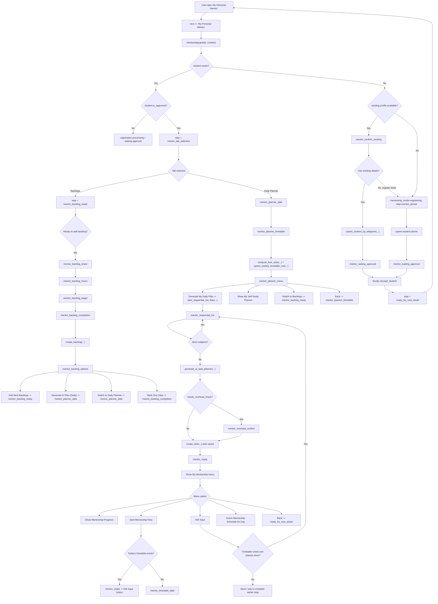

# My Personal Mentor Flowchart

```mermaid
flowchart TD
    A["User taps 'My Personal Mentor'"] --> B["text == 'My Personal Mentor'"]
    B --> C["mentorship(update, context)"]

    C --> D{"student exists?"}
    D -- "No" --> R1{"existing profile available?"}
    D -- "Yes" --> E{"student.is_approved?"}

    E -- "No" --> W["registration processing / waiting approval"]
    E -- "Yes" --> F["step = mentor_tab_selection"]
    F --> G{"Tab selected"}

    G -- "Backlogs" --> H["step = mentor_backlog_ready"]
    H --> I{"Ready to add backlog?"}
    I -- "Yes" --> J["mentor_backlog_share"]
    J --> K["mentor_backlog_hours"]
    K --> L["mentor_backlog_target"]
    L --> M["mentor_backlog_completion"]
    M --> N["create_backlog(...)"]
    N --> O["mentor_backlog_options"]
    O --> O1["Add Next Backlogs -> mentor_backlog_ready"]
    O --> O2["Generate AI Plan (Daily) -> mentor_planner_date"]
    O --> O3["Switch to Daily Planner -> mentor_planner_date"]
    O --> O4["Back One Step -> mentor_backlog_completion"]

    G -- "Daily Planner" --> P["mentor_planner_date"]
    P --> Q["mentor_planner_timetable"]
    Q --> S["compute_free_slots(...) + upsert_weekly_timetable_row(...)"]
    S --> T["mentor_planner_menu"]
    T --> T1["Generate My Daily Plan -> start_sequential_hw_flow(...)"]
    T --> T2["Show My Self-Study Planner"]
    T --> T3["Switch to Backlogs -> mentor_backlog_ready"]
    T --> T4["Back -> mentor_planner_timetable"]

    T1 --> U["mentor_sequential_hw"]
    U --> V{"More subjects?"}
    V -- "Yes" --> U
    V -- "No" --> X["generate_ai_task_planner(...)"]
    X --> Y{"needs_overload_check?"}
    Y -- "Yes" --> Z["mentor_overload_confirm"]
    Y -- "No" --> AA["create_task(...) plan saved"]
    Z --> AA
    AA --> AB["mentor_ready"]

    AB --> AC["Show My Mentorship menu"]
    AC --> AD{"Menu option"}
    AD --> AE["Show Mentorship Progress"]
    AD --> AF["Start Mentorship Flow"]
    AD --> AG["HW Input"]
    AD --> AH["Active Mentorship Schedule for Day"]
    AD --> AI["Back -> ready_for_new_doubt"]

    AF --> AJ{"Today's timetable exists?"}
    AJ -- "Yes" --> AK["mentor_ready -> HW Input button"]
    AJ -- "No" --> AL["mentor_timetable_date"]

    AG --> AM{"Timetable exists and classes done?"}
    AM -- "Yes" --> U
    AM -- "No" --> AN["block / ask to complete earlier step"]

    R1 -- "Yes" --> R2["mentor_confirm_existing"]
    R2 --> R3{"Use existing details?"}
    R3 -- "Yes" --> R4["upsert_student_by_telegram(...)"]
    R4 --> R5["mentor_waiting_approval"]
    R3 -- "No, register fresh" --> R6["mentorship_mode=registering, step=mentor_phone"]

    R1 -- "No" --> R6
    R6 --> R7["upsert student phone"]
    R7 --> R8["mentor_waiting_approval"]
    R5 --> R9["faculty /accept_student"]
    R8 --> R9
    R9 --> R10["step = ready_for_new_doubt"]
    R10 --> A
```
